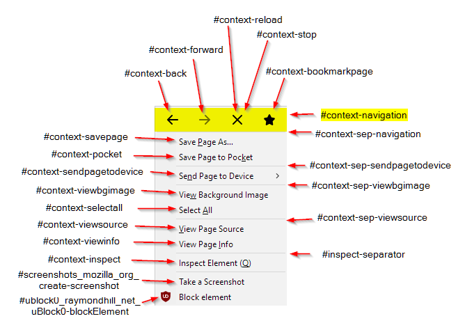
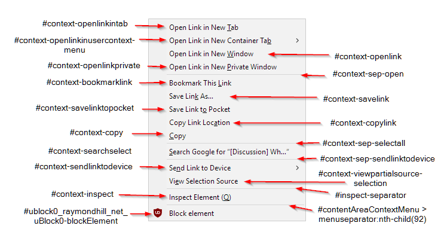

# How To Edit Your Context Menu

<https://www.reddit.com/r/firefox/comments/7dvtw0/guide_how_to_edit_your_context_menu/>

## Get the CSS selectors of the elements you want to edit

### Right click menu

### Right click on link

### List of selectors

    #context-back
    #context-bookmarklink
    #context-bookmarkpage
    #context-forward
    #context-inspect
    #context-inspect
    #context-navigation
    #context-openlink
    #context-openlinkintab
    #context-openlinkinusercontext-menu
    #context-openlinkprivate
    #context-pocket
    #context-reload
    #context-savelink
    #context-savelinktopocket
    #context-savepage
    #context-searchselect
    #context-selectall
    #context-sendlinktodevice
    #context-sendpagetodevice
    #context-sep-navigation
    #context-sep-open
    #context-sep-selectall
    #context-sep-sendlinktodevice
    #context-sep-sendpagetodevice
    #context-sep-viewbgimage
    #context-sep-viewsource
    #context-stop
    #context-viewbgimage
    #context-viewinfo
    #context-viewpartialsource-selection
    #context-viewsource
    #inspect-separator
    #screenshots_mozilla_org_create-screenshot
    #ublock0_raymondhill_net_uBlock0-blockElement

If an element is missing from the list or you want to know how to get the selectors by hand:

1. [Enable Browser Toolbox](https://developer.mozilla.org/en-US/docs/Tools/Browser_Toolbox#Enabling_the_Browser_Toolbox) if you haven't done so already.

2. For [debugging popups](https://developer.mozilla.org/en-US/docs/Tools/Browser_Toolbox#Debugging_popups), click the icon that [looks like 4 squares](https://mdn.mozillademos.org/files/12742/browser-toolbox-autohide-button.png) on the top right. This will make the context menu stay visible.

3. Switch to the browser window, right click somewhere to make the context menu show up.

4. Switch back to the Browser Toolbox, click the icon on the top left that looks like a pointer over a rectangle. This will show you the CSS for the element you point at.

5. Now move your pointer to the context menu item whose ID you want to find out. It should get highlighted with a red border.

6. Switch back to the Browser Toolbox. The left hand pane should have a selected entry. You can `right click > copy > CSS Selector` to get the right selector.

## To remove entries from the context menu you need to

1. Create `userchrome.css` if you haven't already

2. Open the userchrome.css for your current profile with a text editor.

3. Write an entry with your CSS selectors _(separated by commas)_ and hide them.

Like so

    #context-navigation, #context-sep-navigation {
        display: none !important
    }

## To change the position of a context menu entry you have to:

1. Give the item you want on the very top a -moz-box-ordinal-group: 0, without doing anything for any other item.

2. This example will put the search of selected text on top of the context menu.

Demo:

    #context-searchselect {
        -moz-box-ordinal-group: 0 !important;
    }

If you want to move an item to the very bottom, use `-moz-box-ordinal-group: 2` _(or any number >1)_, again, without doing anything for any other item.

If you want to move multiple items to the very bottom, then give only these items increasing `-moz-box-ordinal-group` e.g. 2, 3, 20 and so on. The highest number will be at the bottom. If you give all of these the same number, then while they will stick together at the bottom, they might rearrange amongst themselves depending on when and how they are being added / removed.

You could give each menu entry a distinct ordinal number to exactly put them where you want them but I found I only really needed to move my context search to the top of the menu for maximum convenience.
